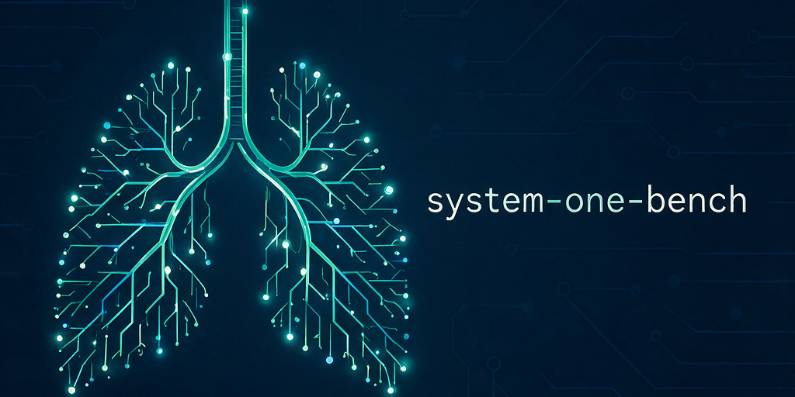

# system-one-bench: banco de pruebas de decisores "System One"

**Versión 1.4.0** — ver [`CHANGELOG.md`](CHANGELOG.md).

Banco de pruebas para comparar **Jev** (TypeSafe), un modelo cerrado que no genera texto sino
que responde preguntas tipadas con probabilidades, con las alternativas abiertas que prometen lo
mismo: **Decider** (Mapika), **AnyJev** (Nokia), **GLiNER2.5-Decide** (fastino), **Laya**
(ConvAI), **Julia-1** (SupersonicLabs), **Nimble-9B** (Bespoke Labs) y **Tev1** (Together AI).
También compara **Span-01** (Respan) y un **LLM generalista** (gpt-6-luna) a través de
`system-one-adapter`, el cliente de TypeSafe que imita a Jev con un LLM.

El dominio es la neumología y la neumología intervencionista:
- **triaje** de mensajes (a qué departamento va, urgencia, si es clínico, si es hostil, si hay
  que responder hoy);
- **lectura de papers** (relevancia, dominio, diseño, profundidad de lectura);
- **mensajes manipulados** (phishing, inyecciones, presión, timos).

Todos los modelos reciben los mismos casos y las mismas preguntas, y se puntúan con el mismo
scorer.

> **Este repositorio es un espejo público** de un repo de desarrollo privado: se publica por
> versión, saneado (sin infraestructura ni datos de autor), con `python3 -m jevbench.publish`.
> Los hashes de commit del `CHANGELOG.md` y los `meta.git` de `results/` se refieren al repo de
> desarrollo, no a este historial. Los abstracts de los papers no se distribuyen: quedan solo
> los metadatos y su hash, y `python3 -m jevbench.fetch_abstracts` los reconstruye desde PubMed.

> **Web de resultados (pública):** <https://system-one-bench.netlify.app/>. Incluye el resumen,
> un explorador caso a caso, aciertos por pregunta, matrices de confusión, calibración, un
> comparador A/B, qué cambia el revisor, coste y latencia, y la metodología.

## Resultado en una línea

La mejor configuración medida es **Jev → revisor Jev**: una segunda llamada que audita la primera
respuesta, más una **alerta para revisión humana** cuando el revisor detecta manipulación. Con
Decider-4B en local como primera pasada y Jev como revisor se obtiene la misma calidad, y el
primer revisor abierto que cumple el criterio fijado es **Clef-27B** (cascada 100 % local
Decider-4B → Clef-27B). En una sola pasada, el mejor agregado lo tiene gpt-6.1-sol (LLM por API)
y, entre los abiertos, Clef-27B como decisor dedicado y **Qwen3.8-27B servido por Cerebras**
(59, por encima de Jev) como LLM generalista.

Detalle en [`docs/resultados.md`](docs/resultados.md) y [`docs/experimentos/`](docs/experimentos/).

## ⚠️ Aviso sobre el ground truth

Lee esto antes de citar ninguna cifra:

- **Los casos son inventados.** Ningún mensaje procede de pacientes reales; los nombres son
  ficticios. Los papers son publicaciones reales de PubMed.
- **El ground truth no es un estándar clínico.** Lo redactaron modelos de lenguaje y lo revisaron
  personas en distinto grado, según el set:

  | Set | Casos | Quién redactó el GT | Quién lo validó |
  |---|---|---|---|
  | Triaje ES/EN, papers, adversarial 1–2 | 14 (×2 idiomas), 31, 10+10 | Un agente LLM (Lyra), 20–23 sep 2026 | Sin revisión sistemática; 11 cambios de campo posteriores (2 en P04 y 9 de la adjudicación de la 2ª anotación); GT v4 elimina el duplicado P02 |
  | Triaje ampliado ES/EN, adversarial 3–4 | 26 (×2), 20, 20 | Claude | El responsable del proyecto, antes de ejecutar ningún modelo |
  | Adversarial 5 | 20 | Claude | Claude, por delegación (sin revisión humana) |

- **El GT tiene ruido medido.** En una segunda anotación humana sobre campos en disputa, el acuerdo
  con el GT fue del 58 % en urgencia y del 65 % en "¿hay que responder hoy?". Diferencias de 1–2
  puntos en esas preguntas no significan nada
  ([`docs/segunda_anotacion/resultados.md`](docs/segunda_anotacion/resultados.md)).
- **Los sets son pequeños** (10–31 casos). Usa siempre los intervalos de confianza y el test
  pareado de McNemar (`--vs`) antes de afirmar que un modelo es mejor.
- **Adversarial 1 y 2 están desequilibrados:** responder siempre `admin` saca 17/20. Para comparar
  modelos en manipulación, usa adversarial 3–5.
- **Un solo dominio clínico.** Nada de esto dice cómo se comportan los modelos en otras
  especialidades.
- **No es una herramienta clínica.** Es un experimento de evaluación de modelos: no sirve para
  decidir sobre pacientes.

Todos los cambios del GT están en [`data/GT_CHANGELOG.md`](data/GT_CHANGELOG.md), con las
versiones anteriores conservadas (`*.v1.json`, `*.v2.json` y los papers `*.v3.json`).
El GT actual es v4: 194 casos en 11 fases (191 sin OOD); la fase `papers32` mantiene
su nombre, con 31 papers tras retirar P02 y conservar P03 sin cambios.

## Cómo repetir las pruebas

Requisitos: Python 3.12. El núcleo del harness (`jevbench/`) solo usa la librería estándar; cada
modelo necesita además su propio paquete.

### Nivel 1: rehacer las cuentas (sin claves ni GPU)

Los resultados de todas las ejecuciones están versionados en `results/`, con las respuestas y
probabilidades completas.

```bash
git clone https://github.com/Mindbreaker81/system-one-bench-public && cd system-one-bench-public
python3 -m unittest discover tests            # re-puntúa los informes originales y valida el scorer
python3 -m jevbench.score --summary jev_v3 jev_cascade_audit decider_4b anyjev_qwen3_32b_l0
python3 -m jevbench.score jev_v3 decider_4b --vs jev_v3 --misses    # detalle por pregunta + McNemar
python3 -m jevbench.report --check            # ¿está docs/resultados.md al día?
```

Puntuar no necesita el texto de los papers. Si `data/papers32.json` no trae los abstracts
(espejo público), `python3 -m jevbench.fetch_abstracts` los descarga de PubMed y comprueba su
hash — solo hace falta para *ejecutar* modelos en la fase `papers32`, no para rehacer las cuentas.

### Nivel 2: repetir Jev y la cascada (clave de API, < $0.02)

Crea `.env` a partir de `.env.example` con `OPENROUTER_API_KEY`, o con `TYPESAFE_API_KEY` si
tienes acceso directo a TypeSafe.

```bash
python3 -m jevbench.check_versions            # ¿qué versión de Jev se sirve hoy? (todo está medido con jev-1.13)
python3 -m jevbench.run jev --run mi_jev --phases all+new
python3 -m jevbench.run jev --run mi_jev --phases adv4,adv5
python3 -m jevbench.cascade --d1 mi_jev --prefix mi_jev_cascade --control "" \
    --phases triage_es,triage_en,papers32,adv1,adv2,ood,triage_ext_es,triage_ext_en,adv3,adv4,adv5
python3 -m jevbench.score --summary jev_v3 mi_jev mi_jev_cascade_audit
```

Jev muestrea con algo de ruido entre llamadas: espera diferencias pequeñas (del orden de 1 punto)
respecto a `jev_v3`. Si `check_versions` muestra una versión distinta de jev-1.13, los números
pueden cambiar más.

### Nivel 3: repetir los modelos abiertos (GPU)

Se ejecutaron en dos NVIDIA DGX Spark (aarch64, GB10, CUDA 13). Una GPU x86 con ~24 GB basta para
todo salvo Decider-35B y AnyJev-32B.

1. Crea un entorno por framework (sus dependencias chocan). En los Spark se usó
   `scripts/setup_venv.sh <nombre> <paquetes…>`: PyTorch cu130 y el Python gestionado por `uv`,
   que trae `Python.h`, necesario para Triton.

   | Modelo | Paquetes | Notas |
   |---|---|---|
   | Decider | `decider-ai` | 35B-A3B: `--opt use_graphs=false`. NVFP4: vLLM 0.29 + `nvidia-modelopt` (`scripts/serve_decider_nvfp4.sh`) |
   | AnyJev | `"anyjev[hf]" accelerate` | nivel L0, sin etiquetas |
   | GLiNER | `gliner2 transformers sentencepiece protobuf peft numpy` | `--opt labels=desc` |
   | Laya | `laya` | `--opt variant=router` |
   | Julia-1 | `snapshot_download('SupersonicLabs/Julia-1')` + `pip install -e` | CPU |
   | LLM (`llm`) | `"system-one-adapter[openai]==0.2.1"` | API; `--opt mode=probabilities\|discrete`, `OPENAI_API_KEY` |
   | Nimble-9B | `transformers==5.17.0 peft==0.21.0 accelerate==1.15.0` | CUDA bf16; scorer oficial fijado y verificado por hash |
   | Tev1 | `transformers==5.17.0` | CUDA bf16; 4B y 0.8B usan el mismo adaptador |

2. Ejecuta la batería con el adaptador correspondiente. Ejemplos:

   ```bash
   python3 -m jevbench.run decider --run decider_4b --opt model=Mapika/decider-4b --phases all+new
   python3 -m jevbench.run anyjev  --run anyjev_qwen3_8b_l0 --opt model=Qwen/Qwen3-8B --phases all+new
   python3 -m jevbench.run gliner  --run gliner_decide_desc --opt model=fastino/GLiNER2.5-Decide --opt labels=desc --opt device=cuda
   python3 -m jevbench.run nimble  --run nimble_9b --opt model=bespokelabs/Bespoke-Nimble-9B --phases all+new
   python3 -m jevbench.run tev1    --run tev1_4b --opt model=togethercomputer/Tev1-4B-experimental --phases all+new
   ```

3. Puntúa con `jevbench.score` como en el nivel 1. Decider, AnyJev L0 y Laya son deterministas: los
   resultados deberían coincidir salvo por el redondeo propio del hardware.

Fichas de cada modelo, con sus enlaces a Hugging Face y GitHub: [`docs/modelos.md`](docs/modelos.md).

### Añadir un modelo

Un adaptador hereda de `jevbench.adapters.Adapter`, implementa `decide(state, questions)` con
preguntas y respuestas en el formato de TypeSafe (`choice` / `score` / `noul`) y se registra en
`jevbench/adapters/__init__.py`. Las preguntas no se tocan: están definidas una sola vez en
`jevbench/battery.py`, y cada resultado guarda un hash para detectar cambios.


Historial de lo realizado: [`CHANGELOG.md`](CHANGELOG.md).

## Estructura

```
jevbench/     harness: batería, runner, scorer, cascada, adaptadores, informe
data/         casos y ground truth (versionado; cambios en GT_CHANGELOG.md)
results/      resultados de cada ejecución (<run>/<fase>.json), con metadatos y probabilidades
docs/         resultados, experimentos pre-registrados, modelos y segunda anotación
tests/        regresión del scorer, informe y versionado
scripts/      entornos y colas para ejecutar los modelos abiertos en GPU
legacy/       batería e informes originales (20–25 sep 2026), solo lectura
```

## Licencia

Código (harness `jevbench`, scripts y tests): **MIT** ([`LICENSE`](LICENSE)).
Casos, ground truth, resultados e informes (`data/`, `results/`, `docs/`, `legacy/`):
**CC BY 4.0** ([`LICENSE-DATA`](LICENSE-DATA)).

Los modelos evaluados tienen sus propias licencias: consúltalas en sus páginas.
